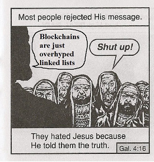
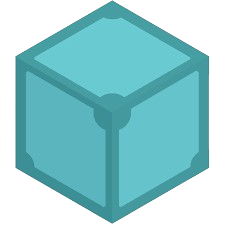
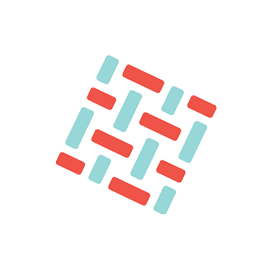

    

### <h1 align="center">👨‍💻 About Me</h1>

🤝 I’m Suman Samanta — Full Stack + Web3 dev. I build dApps, smart contracts, and mildly regretful backend decisions. It's fine. It compiles.

### <h2 align="center">🌐 Socials</h2>

    
    
    
    
    

### <h2 align="center">💻 Tech Stack</h2>

    
    
    
    
    
    
    
    
    
    
    
    
    
    
    
    
    
    
    
    
    
    
    
    
    
    
    
    
    
    
    

### <h2 align="center">🔥 My Stats</h2>

    

